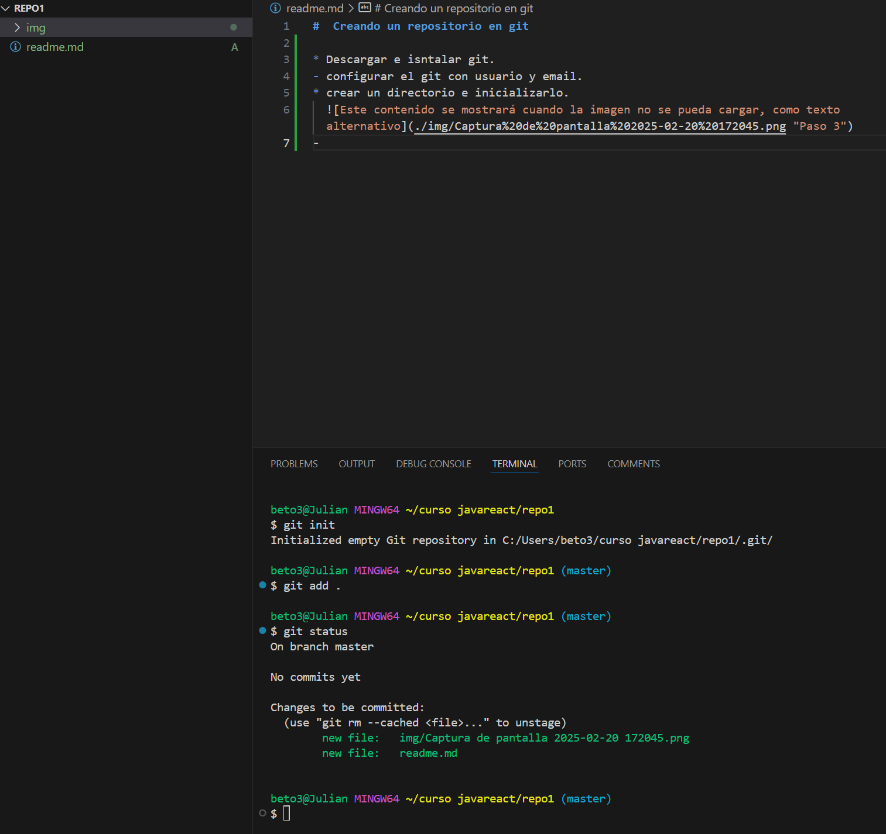

#  Creando un repositorio en git

* Descargar e isntalar git.
- configurar el git con usuario y email.
* crear un directorio e inicializarlo.
  
- Añadir el archivo al stage area y hacer un status
  
* Realizar el primer commit:
  * Ahora mismo acabamos nos encontramos en el estado "Commited"
  
- Crear el repositorio remoto y pushearlo.
-   
  